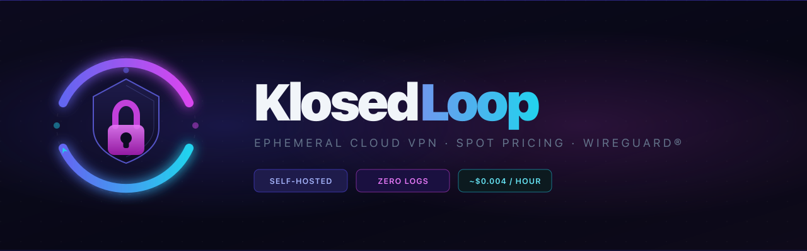
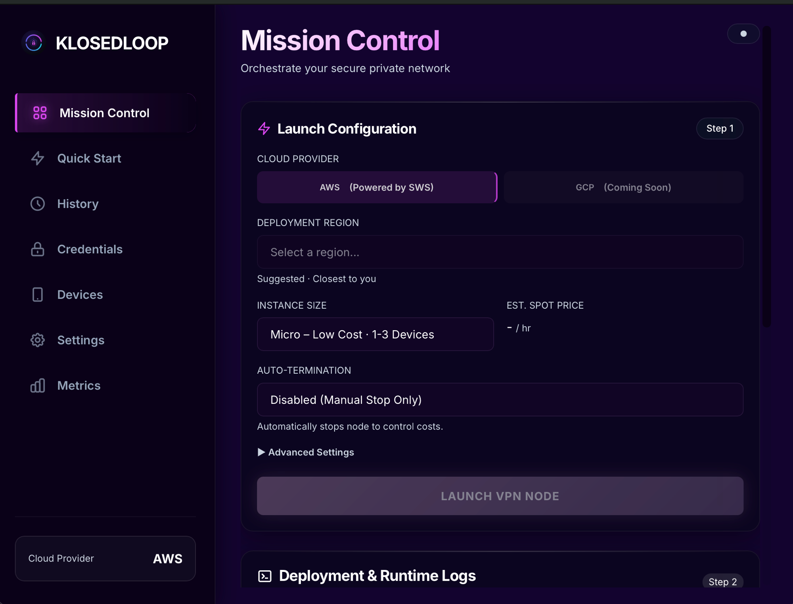
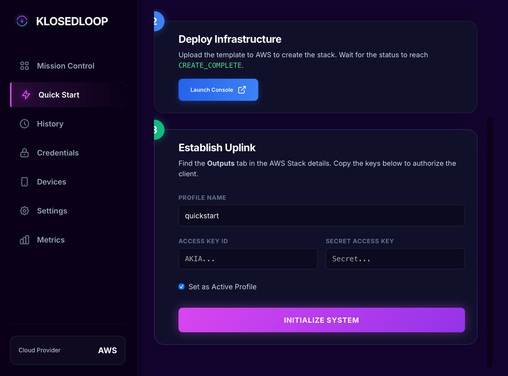
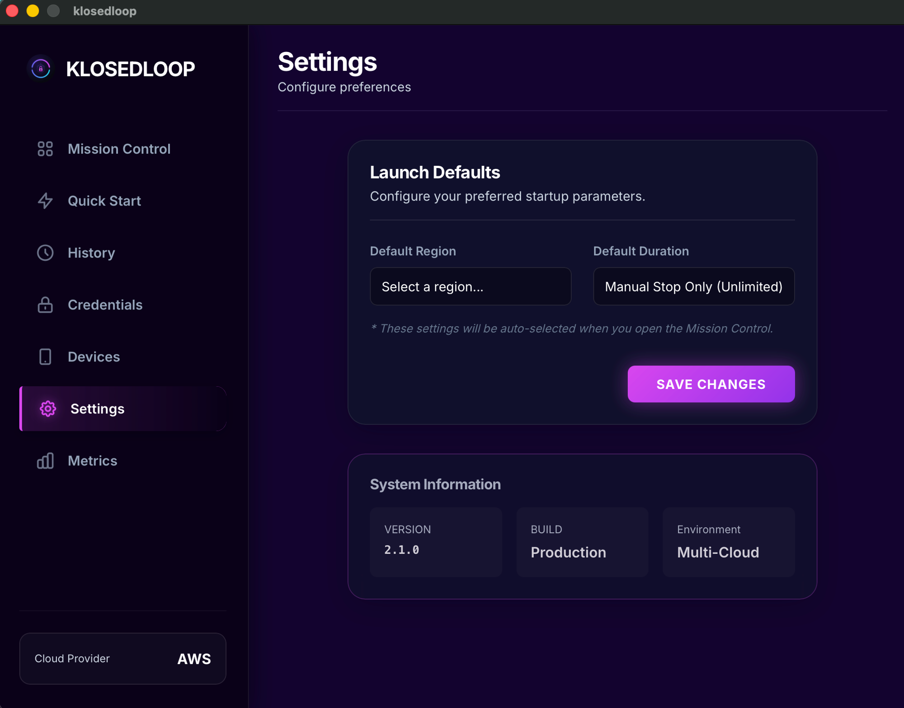

<div align="center">



<br/>

[](https://go.dev/)
[](LICENSE)
[](#building-from-source)
[](https://www.wireguard.com/)
[](https://aws.amazon.com/ec2/spot/)

**Two minutes from credentials to live tunnel.**  
Your keypair, your EC2 instance, your traffic. No subscription, no third-party provider, no logs.

[Quick Start](#quick-start) · [How It Works](#how-it-works) · [Security](#security) · [Build from Source](#building-from-source) · [FAQ](#faq)

</div>

---

## Screenshots

<div align="center">

<br/><sub>Mission Control — launch a VPN node in under two minutes</sub>
<br/><br/>

<br/><sub>Quick Start — guided setup from CloudFormation to live credentials</sub>
<br/><br/>

<br/><sub>Settings — launch defaults and system information</sub>
</div>

---

## How it compares

| | Commercial VPN | Self-hosted (manual) | **KlosedLoop** |
|---|:---:|:---:|:---:|
| Traffic private from provider | ✗ | ✓ | ✓ |
| Static IP that can be tracked | ✗ | ✓ New IP each session | ✓ New IP each session |
| Setup time | Instant | 30–60 min | **< 2 min** |
| Monthly cost | $5–15 | Variable | **~$0.004 / hr** |
| Multi-device | Varies | Manual | ✓ Built-in |
| Open source | ✗ | ✓ | ✓ |

Eight hours on a `t3.micro` Spot instance works out to about $0.03 in most regions. A month of daily sessions is under a dollar.

---

## What It Does

Every session spins up a fresh EC2 instance with a new IP and a freshly generated WireGuard keypair. When the session ends (or the auto-termination timer fires), the instance is destroyed, the IP is released, and nothing persists on the server side.

- **WireGuard® only.** Curve25519 / ChaCha20-Poly1305. Noticeably faster than OpenVPN in practice, and the codebase is small enough to actually audit.
- All keypairs are generated on your machine before launch. The server receives only public keys via EC2 User Data; private keys go nowhere.
- Per-device configs and QR codes in a single launch; every peer gets its own config.
- **Auto-termination** timers: 1 h / 4 h / 8 h / 24 h. The instance destroys itself.
- The region picker shows live latency to EC2 endpoints so you can choose the fastest one rather than guessing.
- If a Spot request hits `InsufficientInstanceCapacity`, KlosedLoop retries every availability zone in the region before failing.
- Spot interruptions are polled every 30 seconds; you'll see an in-app alert within half a minute of the instance going away.
- On startup, any KlosedLoop-tagged instance that shouldn't be running is flagged for termination. Catches anything left over from a crash or forced quit.
- App restart mid-session restores all device configs and QR codes from local storage.

---

## Quick Start

**1. Create AWS credentials**

Create a dedicated IAM user with only the permissions listed in [AWS Permissions](#aws-permissions) below. Don't use your root account, and don't grant admin access to save time; it'll come back to bite you.

**2. Install WireGuard on your devices**

KlosedLoop generates the configs; you import them into the WireGuard client. See [Install WireGuard](#install-wireguard) for your platform.

**3. Add your devices**

Open **Devices** and name each one (e.g. `MacBook`, `iPhone`). You'll get a separate config and QR code per device at launch.

**4. Launch**

**Mission Control** → select a region → set a duration → **LAUNCH VPN NODE**. The node is usually ready in 60–90 seconds. Import the config or scan the QR code directly into WireGuard.

---

## AWS Permissions

```json
{
  "Version": "2012-10-17",
  "Statement": [{
    "Effect": "Allow",
    "Action": [
      "ec2:DescribeRegions",
      "ec2:DescribeImages",
      "ec2:DescribeInstances",
      "ec2:DescribeSpotPriceHistory",
      "ec2:DescribeVpcs",
      "ec2:DescribeSubnets",
      "ec2:DescribeSecurityGroups",
      "ec2:CreateSecurityGroup",
      "ec2:AuthorizeSecurityGroupIngress",
      "ec2:AuthorizeSecurityGroupEgress",
      "ec2:RunInstances",
      "ec2:TerminateInstances",
      "ec2:CreateTags",
      "ec2:GetConsoleOutput"
    ],
    "Resource": "*"
  }]
}
```

---

## Install WireGuard

| Platform | Install |
|---|---|
| macOS | `brew install wireguard-tools` or [wireguard.com/install](https://www.wireguard.com/install/) |
| iOS / Android | WireGuard app (scan the QR code from KlosedLoop) |
| Windows | [wireguard.com/install](https://www.wireguard.com/install/) |
| Linux | `apt install wireguard` / `dnf install wireguard-tools` |

---

## How It Works

```
┌─────────────────────┐    public keys via EC2 User Data    ┌──────────────────────┐
│     KlosedLoop      │ ──────────────────────────────────► │   EC2 Spot (t3)      │
│   (your machine)    │                                     │   Amazon Linux 2023  │
│                     │ ◄───────── WireGuard tunnel ──────── │   wg0 · UDP 51820    │
└─────────────────────┘                                     └──────────────────────┘
         │
         ├─ Generates server + per-device keypairs (Curve25519) locally
         ├─ Embeds all public keys in the EC2 launch script
         ├─ Private keys written only to ~/.klosedloop/ (mode 0600)
         └─ On termination: instance destroyed, IP released, security group removed
```

The instance boots Amazon Linux 2023, runs a User Data script that installs `wireguard-tools` and brings up `wg0`, then does nothing else. No SSH access, no management plane, no persistent storage. The security group permits only UDP 51820. Instance metadata is locked to IMDSv2.

---

## Security

| Property | Detail |
|---|---|
| AWS credentials | `~/.aws/credentials`, mode `0600`, never transmitted |
| WireGuard private keys | Generated in memory; written to `~/.klosedloop/config.ini`, mode `0600` |
| Instance metadata | IMDSv2 enforced on every launch |
| Security groups | Created fresh per session, UDP 51820 only, removed on termination |
| Server keypair | Unique per session; rotates on every launch |

KlosedLoop makes no outbound connections other than to AWS APIs. There's no telemetry, no update check, no account required.

---

## Cloud Providers

| Provider | Status |
|---|---|
| AWS | ✅ Active (EC2 Spot, all regions) |
| GCP | 🔜 Coming Soon |
| Azure | 📋 Planned |

---

## Building from Source

**Requirements**: Go 1.22+, Node.js 18+, Wails CLI v2.

```bash
# Install Wails
go install github.com/wailsapp/wails/v2/cmd/wails@latest

# Clone
git clone <repo-url>
cd klosedloop-v1

# Dev mode with hot reload
wails dev

# Production build
wails build
# → build/bin/klosedloop.app  (macOS)
# → build/bin/klosedloop.exe  (Windows)
# → build/bin/klosedloop      (Linux)

# Run tests
go test ./...
```

See [BUILD_INSTRUCTIONS.md](BUILD_INSTRUCTIONS.md) for code signing, Windows NSIS installers, and CI/CD setup.

---

## Tech Stack

| Layer | Technology |
|---|---|
| Backend | Go 1.22, AWS SDK v2 |
| Frontend | React 18, TypeScript 5, Vite 5, Tailwind CSS |
| Desktop framework | Wails v2 (Go + WebKit / WebView2) |
| VPN protocol | WireGuard® (Curve25519 / ChaCha20-Poly1305) |
| Persistence | INI at `~/.klosedloop/` |

---

## FAQ

**Does KlosedLoop install WireGuard or touch my networking stack?**

No. It generates config files that you import into the WireGuard client yourself. No elevated privileges required, no daemon installed, no kernel extensions.

**What happens if AWS reclaims my Spot instance mid-session?**

You'll lose the tunnel. Spot interruptions nominally give two minutes' notice but in practice the connection drops before the signal arrives. KlosedLoop polls instance state every 30 seconds and shows an alert when it detects the change. Treat it as an advisory, not a graceful handover. If you need continuous uptime, on-demand pricing is worth the extra cent or two per hour.

**Does the server retain anything between sessions?**

Nothing. `InstanceInitiatedShutdownBehavior` is set to `terminate` at launch, so the instance and its root volume are destroyed on shutdown. If you need an audit trail, CloudTrail will have the User Data delivery event; the instance itself won't.

**What if Spot capacity isn't available in my region?**

KlosedLoop tries every default subnet in the region before giving up. `us-east-1` almost always has capacity somewhere. If you're consistently hitting this, `eu-west-1` and `us-west-2` tend to be reliable alternatives.

**Is my traffic routed through any third party?**

No. Your device connects directly to your EC2 instance. KlosedLoop is a setup tool; it's not in the data path.

**What does it cost?**

Free and MIT licensed. You pay for Spot time only; roughly $0.003–0.006/hr depending on region. Use auto-termination and don't leave instances running unattended.

**Can I use a corporate AWS account?**

You can, but I'd advise against it. Spinning up security groups and Spot instances in a shared corporate account will confuse your cloud team and likely trip change-management controls. Use a personal account or a dedicated sandbox.

---

## Contributing

Pull requests welcome. Open an issue first for anything substantial.

```bash
go test ./...                  # backend tests
gofmt -w .                     # format Go
cd frontend && npm run build   # verify frontend compiles
```

---

## Licence

MIT. See [LICENSE](LICENSE).

---

<div align="center">
<sub>WireGuard is a registered trademark of Jason A. Donenfeld. AWS is a trademark of Amazon Web Services, Inc.</sub>
</div>
